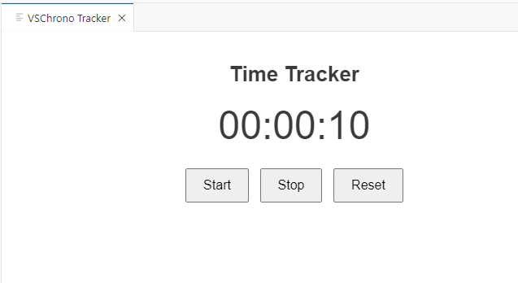

# VSChrono

VSChrono is a [Visual Studio Code](https://code.visualstudio.com/) extension to track your time whilst coding, such as for keeping hours

## Features
- Start and stop timer
- Tracks when window is closed
- Supports reset
